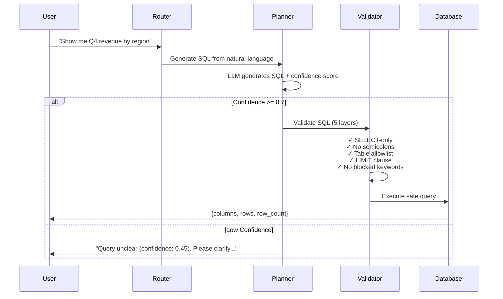
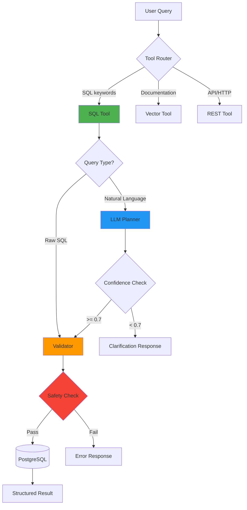
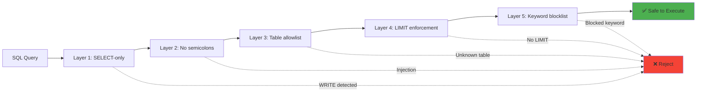

# 🚀 Enterprise Tool Router

> **AI-powered tool routing with enterprise-grade safety, observability, and natural language SQL generation**

A production-ready LLM tool router that intelligently routes natural language queries to the right backend tool (SQL, Vector Search, REST API) with **deterministic safety validation**, structured outputs, and audit logging.

[](https://github.com/holdersav20001/enterprise-tool-router/actions)

---

## 🎯 What Does This Do?

**Problem:** Enterprise users ask questions in natural language, but you need to route them to different backend systems (databases, document stores, APIs) while ensuring **safety, auditability, and reliability**.

**Solution:** This router:
1. **Understands** natural language queries using LLMs
2. **Routes** to the appropriate tool (SQL, vector search, or REST API)
3. **Validates** all generated code through deterministic safety layers
4. **Executes** queries safely with row limits and read-only enforcement
5. **Audits** every operation with append-only logging

---

## ✨ Key Features

### 🛡️ **Safety-First Architecture**
- **LLM proposes → Validator approves → System executes**
- 5-layer SQL safety validation (no writes, no semicolons, table allowlists, mandatory LIMIT clauses)
- Confidence thresholds prevent speculative execution of uncertain queries
- All outputs validated against Pydantic schemas

### 🧠 **Natural Language SQL Generation**


### 📊 **Deterministic Tool Routing**
- Pattern-based routing (no LLM uncertainty for tool selection)
- 80%+ accuracy on golden test dataset
- Sub-100ms routing latency

### 🔍 **Full Observability**
- Append-only audit logs for every query
- Structured outputs (valid JSON, always)
- Token usage and cost tracking
- Evaluation harness with CI quality gates

---

## 🏗️ Architecture

### High-Level Flow



### Safety Layers



---

## 🚀 Quick Start

### Prerequisites
- Python 3.11+
- Docker (for PostgreSQL database)
- Windows PowerShell / Linux Bash

### Installation

```powershell
# Clone the repository
git clone https://github.com/holdersav20001/enterprise-tool-router.git
cd enterprise-tool-router

# Create virtual environment
python -m venv .venv
. .\.venv\Scripts\Activate.ps1  # Windows
# source .venv/bin/activate     # Linux/Mac

# Install dependencies
pip install -r requirements-dev.txt

# Start PostgreSQL database
docker compose up -d

# Initialize database with sample data
python scripts/init_db.py

# Run tests
pytest -v

# Start the API server
python -m enterprise_tool_router.main
```

### API Server
The FastAPI server runs on `http://localhost:8000`

**Try it:**
```bash
curl -X POST http://localhost:8000/query \
  -H "Content-Type: application/json" \
  -d '{"query": "Show me Q4 revenue by region"}'
```

**Response:**
```json
{
  "tool_used": "sql",
  "confidence": 0.92,
  "result": {
    "columns": ["region", "revenue"],
    "rows": [
      ["North", 1250000],
      ["South", 980000],
      ["East", 1100000]
    ],
    "row_count": 3
  },
  "trace_id": "abc123",
  "cost_usd": 0.0023
}
```

---

## 🧪 Examples

### Natural Language SQL
```python
from enterprise_tool_router.router import ToolRouter

router = ToolRouter()

# Natural language query
result = router.handle("Show me revenue trends in Q3 and Q4")

print(result.tool)        # "sql"
print(result.confidence)  # 0.95
print(result.result.data) # {"columns": [...], "rows": [...]}
```

### Raw SQL (Backward Compatible)
```python
# Direct SQL still works (with safety validation)
result = router.handle("SELECT region, SUM(revenue) FROM sales_fact WHERE quarter = 'Q4' GROUP BY region LIMIT 50")

print(result.tool)  # "sql"
```

### Vector Search
```python
# Documentation retrieval
result = router.handle("Find the runbook for schema mismatch incidents")

print(result.tool)  # "vector"
```

### REST API Calls
```python
# External API interaction
result = router.handle("Call API to check service health")

print(result.tool)  # "rest"
```

---

## 🛡️ Safety Guarantees

### SQL Tool Safety
| Attack Vector | Protection Mechanism |
|--------------|---------------------|
| **SQL Injection** | No semicolons, parameterized queries |
| **Data Exfiltration** | Table allowlist, row LIMIT enforcement |
| **Unauthorized Writes** | SELECT-only enforcement |
| **Malicious LLM Output** | 5-layer deterministic validation |
| **Low-Confidence Queries** | Threshold gating (default: 0.7) |

**Example: Malicious LLM Output Blocked**
```python
# Even if LLM tries to generate malicious SQL, validator rejects it
LLM Output: "SELECT * FROM sales_fact; DROP TABLE audit_log"
Validator:   ❌ REJECTED (semicolon detected)
Result:      {"error": "SQL safety validation failed"}
```

### Audit Logging
Every query is logged with:
- Timestamp (UTC)
- Tool used
- Input query (original)
- Output result (structured)
- User ID (if authenticated)
- Success/failure status

```sql
SELECT * FROM audit_log
WHERE tool = 'sql'
  AND status = 'success'
  AND created_at > NOW() - INTERVAL '24 hours'
LIMIT 100;
```

---

## 📁 Project Structure

```
enterprise-tool-router/
├── src/enterprise_tool_router/
│   ├── router.py              # Main routing logic
│   ├── tools/
│   │   ├── sql.py             # SQL tool with planner integration
│   │   ├── vector.py          # Vector search tool
│   │   └── rest.py            # REST API tool
│   ├── llm/
│   │   ├── base.py            # LLM provider interface
│   │   ├── providers/
│   │   │   ├── anthropic.py   # Claude integration
│   │   │   ├── openai.py      # GPT integration
│   │   │   └── mock.py        # Testing provider
│   │   └── sql_planner.py     # Natural language → SQL
│   ├── schemas.py             # API response schemas
│   ├── schemas_sql.py         # SQL result schemas
│   ├── audit.py               # Audit logging
│   └── main.py                # FastAPI server
├── tests/                     # 104+ unit & integration tests
├── eval/                      # Evaluation harness
│   ├── golden_cases_v0.jsonl  # Router test cases
│   ├── golden_cases_v1_planner.jsonl  # Planner test cases
│   └── runner.py              # CI quality gates
├── docs/
│   ├── llm-sql-generation.md  # Technical deep-dive
│   └── architecture.md        # System design
└── .github/workflows/
    └── ci.yml                 # Automated testing
```

---

## 🧑‍💻 Development

### Running Tests
```bash
# All tests
pytest -v

# Specific test file
pytest tests/test_sql_planner_integration.py -v

# With coverage
pytest --cov=enterprise_tool_router --cov-report=html
```

### Evaluation Harness
```bash
# Run evaluation with quality gates
python -m eval.runner --cases eval/golden_cases_v0.jsonl

# Expected output:
# ✅ Schema compliance: 100%
# ✅ Routing accuracy: 92%
# ✅ SQL validation rate: 100%
```

### CI Quality Gates
- **Week 1:** Schema compliance >= 100%
- **Week 2:** Routing accuracy >= 70%
- **Week 3:** Planner schema compliance >= 100%, routing accuracy >= 80%

---

## 🗄️ Database Setup

### Local Development (Docker)
```powershell
# Start PostgreSQL
docker compose up -d

# View logs
docker compose logs -f postgres

# Connect to database
docker exec -it etr-postgres psql -U etr_user -d etr_db

# Stop (preserves data)
docker compose down

# Stop and remove data (WARNING: irreversible)
docker compose down -v
```

### Database Schema
```sql
-- Sales data (seeded with 1000 rows)
CREATE TABLE sales_fact (
    region VARCHAR(50),
    quarter VARCHAR(10),
    revenue NUMERIC,
    units_sold INTEGER
);

-- Job execution tracking
CREATE TABLE job_runs (
    id SERIAL PRIMARY KEY,
    job_name VARCHAR(100),
    status VARCHAR(20),
    runtime_seconds INTEGER,
    created_at TIMESTAMP
);

-- Audit logs (append-only)
CREATE TABLE audit_log (
    id SERIAL PRIMARY KEY,
    timestamp TIMESTAMPTZ,
    tool VARCHAR(20),
    query_input TEXT,
    query_output JSONB,
    user_id VARCHAR(50),
    status VARCHAR(20)
);
```

---

## 🔧 Configuration

### Environment Variables
```bash
# Database (defaults for local dev)
DB_HOST=localhost
DB_PORT=5433
DB_NAME=etr_db
DB_USER=etr_user
DB_PASSWORD=etr_password  # Override in production!

# LLM Providers (optional, for natural language queries)
ANTHROPIC_API_KEY=sk-ant-...
OPENAI_API_KEY=sk-...
```

### Custom Confidence Threshold
```python
from enterprise_tool_router.tools.sql import SqlTool
from enterprise_tool_router.llm.providers import AnthropicProvider

# Lower threshold for more permissive execution
sql_tool = SqlTool(
    llm_provider=AnthropicProvider(),
    confidence_threshold=0.6  # Default: 0.7
)
```

---

## 📚 Documentation

- **[Technical Deep-Dive](docs/llm-sql-generation.md)** - LLM SQL generation architecture
- **[Architecture Overview](docs/architecture.md)** - System design patterns
- **[ADR 001: SQL Safety Model](docs/adr/001-sql-safety-model.md)** - Safety design decisions
- **[Security Policy](docs/security.md)** - Security guidelines

---

## 🏆 Project Timeline

### ✅ Week 1: Foundation
- Repo structure with AI operating system (skills, runbooks, ADRs)
- FastAPI skeleton with schema-first design
- Deterministic router with pattern matching
- Evaluation harness with golden dataset
- CI quality gates (100% schema compliance)

### ✅ Week 2: PostgreSQL + Safety
- PostgreSQL database with Docker setup
- 5-layer SQL safety validation
- Append-only audit logging
- 70% routing accuracy gate

### ✅ Week 3: LLM SQL Generation
- LLM provider abstraction (Anthropic, OpenAI, Mock)
- Natural language → SQL planner with Pydantic schemas
- Confidence threshold gating (0.7 default)
- Integration with deterministic validator
- 80% routing accuracy gate, 100% planner schema compliance
- **104 tests passing**

---

## 🤝 Contributing

This is a portfolio/demonstration project. Feel free to fork and adapt for your use case.

### Key Design Principles
1. **Safety over convenience** - Deterministic validation always wins
2. **Schemas everywhere** - No unstructured outputs
3. **Audit everything** - Append-only logging for accountability
4. **Test-first** - TDD with comprehensive test coverage
5. **Incremental complexity** - Each week builds on previous foundation

---

## 📄 License

MIT License - see [LICENSE](LICENSE) for details

---

## 🙏 Acknowledgments

Built with:
- [FastAPI](https://fastapi.tiangolo.com/) - Modern Python web framework
- [Pydantic](https://docs.pydantic.dev/) - Data validation with Python type hints
- [PostgreSQL](https://www.postgresql.org/) - Production-grade relational database
- [Anthropic Claude](https://www.anthropic.com/) - LLM for SQL generation
- [pytest](https://pytest.org/) - Testing framework

---

**Built with safety, observability, and enterprise requirements in mind.**

⭐ Star this repo if you find it useful!
