# 🚀 Enterprise Tool Router

> **AI-powered tool routing with enterprise-grade safety, observability, and natural language SQL generation**

A production-ready LLM tool router that intelligently routes natural language queries to the right backend tool (SQL, Vector Search, REST API) with **deterministic safety validation**, structured outputs, and audit logging.

[](https://github.com/holdersav20001/enterprise-tool-router/actions)

---

## 🎯 What Does This Do?

**Problem:** Enterprise users ask questions in natural language, but you need to route them to different backend systems (databases, document stores, APIs) while ensuring **safety, auditability, and reliability**.

**Solution:** This router uses **LLMs to convert natural language into SQL**, then validates and executes it safely:

```python
# User asks a natural language question
router.handle("Show me revenue by region")

# LLM converts to SQL
# → SELECT region, SUM(revenue) FROM sales_fact GROUP BY region LIMIT 100

# Safety validator checks SQL (5 layers)
# → ✓ SELECT-only, ✓ No semicolons, ✓ Allowlisted tables, ✓ LIMIT clause

# Execute and return results
# → {"columns": ["region", "total_revenue"], "rows": [...]}
```

**How it works:**
1. **LLM converts** natural language → SQL (using OpenRouter with 200+ models)
2. **Routes** to the appropriate tool (SQL, vector search, or REST API)
3. **Validates** all LLM-generated SQL through deterministic safety layers
4. **Executes** queries safely with row limits and read-only enforcement
5. **Audits** every operation with append-only logging

---

## ✨ Key Features

### 🛡️ **Safety-First Architecture**
- **LLM proposes → Validator approves → System executes**
- 5-layer SQL safety validation (no writes, no semicolons, table allowlists, mandatory LIMIT clauses)
- Confidence thresholds prevent speculative execution of uncertain queries
- All outputs validated against Pydantic schemas

### 🧠 **Natural Language SQL Generation**


### 📊 **Deterministic Tool Routing**
- Pattern-based routing (no LLM uncertainty for tool selection)
- 80%+ accuracy on golden test dataset
- Sub-100ms routing latency

### 🔍 **Full Observability**
- Append-only audit logs for every query
- Structured outputs (valid JSON, always)
- Token usage and cost tracking
- Evaluation harness with CI quality gates

### 🔗 **End-to-End Request Tracing**
Every request carries a unique correlation ID through all layers, enabling:
- **Distributed tracing** across microservices
- **Deterministic debugging** of production issues
- **Regulatory compliance** with audit trails
- **Performance analysis** across the entire stack


---

## 🏗️ Architecture

### High-Level Flow


### Safety Layers


---

## 🎯 Tool Routing

The router intelligently routes queries to **3 specialized tools** based on pattern matching:

### **1. SQL Tool** 📊 ✅ Fully Implemented

**Triggers:** Keywords like `SELECT`, `FROM`, `revenue`, `count`, `sum`, `GROUP BY`, or `sql`

**Capabilities:**
- **Natural Language Queries** → SQL Planner (LLM) → Validator → Execution
- **Raw SQL Queries** → Validator → Execution (no LLM needed)
- **5-Layer Safety Validation** (SELECT-only, no semicolons, table allowlist, LIMIT enforcement, keyword blocklist)
- **Confidence Gating** (0.7 threshold - low confidence queries blocked for safety)
- **Structured Output** (always returns Pydantic-validated JSON)

**Examples:**
```python
"Show me Q4 revenue by region"              # → SQL (natural language)
"SELECT * FROM sales_fact LIMIT 10"         # → SQL (raw SQL)
"Count failed jobs in last 24 hours"        # → SQL (natural language)
"What's the total revenue for Q3?"          # → SQL (natural language)
```

**Database:**
- PostgreSQL with seeded data (sales_fact, job_runs, audit_log)
- Read-only queries enforced
- Row limits mandatory

---

### **2. Vector Tool** 🔍 🚧 Stub

**Triggers:** Keywords like `runbook`, `docs`, `how do i`, `procedure`, `playbook`, or `doc`

**Intended Use:**
- Document retrieval (RAG - Retrieval Augmented Generation)
- Runbook/playbook search
- Knowledge base queries
- Troubleshooting guides

**Examples:**
```python
"Where is the runbook for schema mismatch?"     # → Vector
"How do I handle CDC duplicate events?"         # → Vector
"Find troubleshooting guide for DB connection"  # → Vector
"What does the arch doc say about retry logic?" # → Vector
```

**Status:** Architecture in place, ready for integration with:
- Pinecone, Weaviate, Qdrant (cloud vector DBs)
- pgvector (PostgreSQL extension)
- ChromaDB (local/embedded)

**Implementation Week:** 4+

---

### **3. REST Tool** 🌐 🚧 Stub

**Triggers:** Keywords like `call api`, `endpoint`, `http`, `status`, `service`, or `api`

**Intended Use:**
- External API calls
- Service health checks
- HTTP requests (GET, POST, etc.)
- Microservice communication

**Examples:**
```python
"Call API to check service health"          # → REST
"Hit HTTP endpoint /status for payments"    # → REST
"POST request to /api/v1/refresh"           # → REST
"Make GET call to external service"         # → REST
```

**Status:** Architecture in place, ready for integration with:
- `httpx` (async HTTP client)
- `requests` (sync HTTP client)
- API authentication/authorization
- Rate limiting and retry logic

**Implementation Week:** 4+

---

### **Routing Decision Flow**

```mermaid
graph TD
    A[User Query] --> B{Pattern Match}

    B -->|SQL keywords detected| C[SQL Tool ✅]
    B -->|Doc keywords detected| D[Vector Tool 🚧]
    B -->|API keywords detected| E[REST Tool 🚧]
    B -->|No match| F[Unknown ❌]

    C --> C1[Process Query]
    D --> D1[Return Stub]
    E --> E1[Return Stub]
    F --> F1[Error: No confident tool match]

    style C fill:#4CAF50
    style C1 fill:#4CAF50
    style D fill:#FF9800
    style E fill:#9C27B0
    style F fill:#F44336
```



### **Implementation Status**

| Tool | Status | Implementation | Next Steps |
|------|--------|----------------|------------|
| **SQL** | ✅ **Production Ready** | Fully implemented with LLM planner, safety validation, confidence gating | Add more table schemas, query optimization |
| **Vector** | 🚧 **Stub** | Architecture ready | Integrate vector DB (pgvector/Pinecone), add embedding model |
| **REST** | 🚧 **Stub** | Architecture ready | Add HTTP client, auth, retry logic, rate limiting |

---

## 🚀 Quick Start

### Prerequisites
- Python 3.11+
- Docker (for PostgreSQL database)
- Windows PowerShell / Linux Bash

### Installation

```powershell
# Clone the repository
git clone https://github.com/holdersav20001/enterprise-tool-router.git
cd enterprise-tool-router

# Create virtual environment
python -m venv .venv
. .\.venv\Scripts\Activate.ps1  # Windows
# source .venv/bin/activate     # Linux/Mac

# Install dependencies
pip install -r requirements-dev.txt

# Start PostgreSQL database
docker compose up -d

# Initialize database with sample data
python scripts/init_db.py

# Run tests
pytest -v

# Start the API server
python -m enterprise_tool_router.main
```

### API Server
The FastAPI server runs on `http://localhost:8000`

**Try it:**
```bash
curl -X POST http://localhost:8000/query \
  -H "Content-Type: application/json" \
  -d '{"query": "Show me Q4 revenue by region"}'
```

**Response:**
```json
{
  "tool_used": "sql",
  "confidence": 0.92,
  "result": {
    "columns": ["region", "revenue"],
    "rows": [
      ["North", 1250000],
      ["South", 980000],
      ["East", 1100000]
    ],
    "row_count": 3
  },
  "trace_id": "abc123",
  "cost_usd": 0.0023
}
```

---

## 🔗 Request Tracing & Correlation IDs

### **How It Works**

Every request automatically gets a **unique correlation ID** that flows through:
1. HTTP middleware (extracts from header or generates UUID)
2. Router layer (propagates to tools)
3. Tool execution (available for internal logging)
4. Audit logging (captured in database)
5. HTTP response (returned to client)

### **Usage Examples**

#### **HTTP API with Custom Correlation ID**
```bash
# Client provides correlation ID
curl -X POST http://localhost:8000/query \
  -H "Content-Type: application/json" \
  -H "x-correlation-id: my-trace-abc-123" \
  -d '{"query": "Show me Q4 revenue"}'

# Response includes same ID
{
  "tool_used": "sql",
  "trace_id": "my-trace-abc-123",  # ← Same ID returned
  "result": {...}
}
```

#### **HTTP API with Auto-Generated ID**
```bash
# No correlation ID header provided
curl -X POST http://localhost:8000/query \
  -H "Content-Type: application/json" \
  -d '{"query": "Show me Q4 revenue"}'

# System auto-generates UUID
{
  "tool_used": "sql",
  "trace_id": "f3e4d5c6-b7a8-9012-cdef-123456789abc",  # ← Auto-generated
  "result": {...}
}
```

#### **Programmatic Usage**
```python
from enterprise_tool_router.router import ToolRouter

router = ToolRouter()

# Provide your own correlation ID
result = router.handle(
    "Show me sales data",
    correlation_id="my-batch-job-001"
)
print(result.result.data)

# Or let it auto-generate
result = router.handle("Show me sales data")
# correlation_id = "a1b2c3d4-5e6f-7890-abcd-ef1234567890" (auto-generated)
```

#### **Querying Audit Logs by Correlation ID**
```python
from enterprise_tool_router.audit import get_audit_records

# Find all operations for a specific request
records = get_audit_records(correlation_id="my-trace-abc-123")

for record in records:
    print(f"Tool: {record['tool']}")
    print(f"Action: {record['action']}")
    print(f"Success: {record['success']}")
    print(f"Duration: {record['duration_ms']}ms")
```

#### **SQL Query on Audit Logs**
```sql
-- Trace a single request across all layers
SELECT
    ts,
    tool,
    action,
    success,
    duration_ms
FROM audit_log
WHERE correlation_id = 'my-trace-abc-123'
ORDER BY ts;

-- Find slow queries
SELECT
    correlation_id,
    tool,
    duration_ms,
    ts
FROM audit_log
WHERE duration_ms > 1000
  AND ts > NOW() - INTERVAL '24 hours'
ORDER BY duration_ms DESC
LIMIT 20;

-- Debug failed requests
SELECT
    correlation_id,
    tool,
    action,
    input_hash,
    ts
FROM audit_log
WHERE success = false
  AND ts > NOW() - INTERVAL '1 hour';
```

### **Production Debugging Workflow**

1. **User reports error** → provides `trace_id` from response
2. **Query audit logs** by `correlation_id`
3. **See exact flow**: routing → tool selection → execution → result
4. **Identify failure point** with timestamps and success flags
5. **Reproduce issue** using captured input data (via hash lookup)

### **Benefits**

| Benefit | Description |
|---------|-------------|
| **Distributed Tracing** | Track requests across multiple services/microservices |
| **Root Cause Analysis** | Pinpoint exact failure points in multi-layer systems |
| **Performance Monitoring** | Measure latency at each layer for a single request |
| **Regulatory Compliance** | Immutable audit trail for financial/healthcare systems |
| **Production Debugging** | Debug issues in production without reproducing locally |
| **SLA Monitoring** | Track end-to-end request duration and success rates |

---

## 🧪 Examples

### Natural Language SQL
```python
from enterprise_tool_router.router import ToolRouter

router = ToolRouter()

# Natural language query
result = router.handle("Show me revenue trends in Q3 and Q4")

print(result.tool)        # "sql"
print(result.confidence)  # 0.95
print(result.result.data) # {"columns": [...], "rows": [...]}
```

### Raw SQL (Backward Compatible)
```python
# Direct SQL still works (with safety validation)
result = router.handle("SELECT region, SUM(revenue) FROM sales_fact WHERE quarter = 'Q4' GROUP BY region LIMIT 50")

print(result.tool)  # "sql"
```

### Vector Search
```python
# Documentation retrieval
result = router.handle("Find the runbook for schema mismatch incidents")

print(result.tool)  # "vector"
```

### REST API Calls
```python
# External API interaction
result = router.handle("Call API to check service health")

print(result.tool)  # "rest"
```

---

## 🛡️ Safety Guarantees

### SQL Tool Safety
| Attack Vector | Protection Mechanism |
|--------------|---------------------|
| **SQL Injection** | No semicolons, parameterized queries |
| **Data Exfiltration** | Table allowlist, row LIMIT enforcement |
| **Unauthorized Writes** | SELECT-only enforcement |
| **Malicious LLM Output** | 5-layer deterministic validation |
| **Low-Confidence Queries** | Threshold gating (default: 0.7) |

**Example: Malicious LLM Output Blocked**
```python
# Even if LLM tries to generate malicious SQL, validator rejects it
LLM Output: "SELECT * FROM sales_fact; DROP TABLE audit_log"
Validator:   ❌ REJECTED (semicolon detected)
Result:      {"error": "SQL safety validation failed"}
```

### Audit Logging
Every query is logged with:
- Timestamp (UTC)
- Tool used
- Input query (original)
- Output result (structured)
- User ID (if authenticated)
- Success/failure status

```sql
SELECT * FROM audit_log
WHERE tool = 'sql'
  AND status = 'success'
  AND created_at > NOW() - INTERVAL '24 hours'
LIMIT 100;
```

---

## 📁 Project Structure

```
enterprise-tool-router/
├── src/enterprise_tool_router/
│   ├── router.py              # Main routing logic
│   ├── tools/
│   │   ├── sql.py             # SQL tool with planner integration
│   │   ├── vector.py          # Vector search tool
│   │   └── rest.py            # REST API tool
│   ├── llm/
│   │   ├── base.py            # LLM provider interface
│   │   ├── providers/
│   │   │   ├── openrouter.py  # OpenRouter integration (default - 200+ models)
│   │   │   ├── anthropic.py   # Claude integration
│   │   │   ├── openai.py      # GPT integration
│   │   │   └── mock.py        # Testing provider
│   │   └── sql_planner.py     # Natural language → SQL (LLM-powered)
│   ├── schemas.py             # API response schemas
│   ├── schemas_sql.py         # SQL result schemas
│   ├── audit.py               # Audit logging
│   └── main.py                # FastAPI server
├── tests/                     # 104+ unit & integration tests
├── eval/                      # Evaluation harness
│   ├── golden_cases_v0.jsonl  # Router test cases
│   ├── golden_cases_v1_planner.jsonl  # Planner test cases
│   └── runner.py              # CI quality gates
├── docs/
│   ├── llm-sql-generation.md  # Technical deep-dive
│   └── architecture.md        # System design
└── .github/workflows/
    └── ci.yml                 # Automated testing
```

---

## 🧑‍💻 Development

### Running Tests
```bash
# All tests
pytest -v

# Specific test file
pytest tests/test_sql_planner_integration.py -v

# With coverage
pytest --cov=enterprise_tool_router --cov-report=html
```

### Evaluation Harness
```bash
# Run evaluation with quality gates
python -m eval.runner --cases eval/golden_cases_v0.jsonl

# Expected output:
# ✅ Schema compliance: 100%
# ✅ Routing accuracy: 92%
# ✅ SQL validation rate: 100%
```

### CI Quality Gates
- **Week 1:** Schema compliance >= 100%
- **Week 2:** Routing accuracy >= 70%
- **Week 3:** Planner schema compliance >= 100%, routing accuracy >= 80%

---

## 🗄️ Database Setup

### Local Development (Docker)
```powershell
# Start PostgreSQL
docker compose up -d

# View logs
docker compose logs -f postgres

# Connect to database
docker exec -it etr-postgres psql -U etr_user -d etr_db

# Stop (preserves data)
docker compose down

# Stop and remove data (WARNING: irreversible)
docker compose down -v
```

### Database Schema
```sql
-- Sales data (seeded with 1000 rows)
CREATE TABLE sales_fact (
    region VARCHAR(50),
    quarter VARCHAR(10),
    revenue NUMERIC,
    units_sold INTEGER
);

-- Job execution tracking
CREATE TABLE job_runs (
    id SERIAL PRIMARY KEY,
    job_name VARCHAR(100),
    status VARCHAR(20),
    runtime_seconds INTEGER,
    created_at TIMESTAMP
);

-- Audit logs (append-only)
CREATE TABLE audit_log (
    id SERIAL PRIMARY KEY,
    timestamp TIMESTAMPTZ,
    tool VARCHAR(20),
    query_input TEXT,
    query_output JSONB,
    user_id VARCHAR(50),
    status VARCHAR(20)
);
```

---

## 🔧 Configuration

### Environment Variables
```bash
# Database (defaults for local dev)
DB_HOST=localhost
DB_PORT=5433
DB_NAME=etr_db
DB_USER=etr_user
DB_PASSWORD=etr_password  # Override in production!

# LLM Providers (optional, for natural language SQL queries via LLM)
# OpenRouter (Recommended - Access to 200+ models including Claude, GPT, Gemini)
OPENROUTER_API_KEY=sk-or-v1-...
OPENROUTER_MODEL=openrouter/aurora-alpha  # Free tier, excellent performance

# Alternative providers
# ANTHROPIC_API_KEY=sk-ant-...
# OPENAI_API_KEY=sk-...
```

### Custom Confidence Threshold
```python
from enterprise_tool_router.tools.sql import SqlTool
from enterprise_tool_router.llm.providers import OpenRouterProvider

# Lower threshold for more permissive execution
sql_tool = SqlTool(
    llm_provider=OpenRouterProvider(),
    confidence_threshold=0.6  # Default: 0.7
)
```

### LLM Timeout Configuration
Week 4 adds timeout protection to prevent hanging on slow/unresponsive LLM providers:

```python
from enterprise_tool_router.tools.sql import SqlTool
from enterprise_tool_router.llm.providers import OpenRouterProvider

# Configure LLM timeout (prevents hanging)
sql_tool = SqlTool(
    llm_provider=OpenRouterProvider(),
    llm_timeout=15.0  # Default: 30.0 seconds
)

# Timeout can also be configured per-query
from enterprise_tool_router.sql_planner import SqlPlanner
planner = SqlPlanner(OpenRouterProvider())
result = planner.plan("Show revenue by region", timeout=10.0)
```

**Features:**
- Graceful timeout handling (returns error, doesn't hang)
- Configurable per-tool or per-query
- Preserves deterministic validator authority
- Full test coverage with MockProvider

**See [OpenRouter Setup Guide](docs/openrouter_setup.md) for detailed configuration**

---

## 📚 Documentation

- **[OpenRouter Setup Guide](docs/openrouter_setup.md)** - Configure OpenRouter LLM provider (200+ models)
- **[Technical Deep-Dive](docs/llm-sql-generation.md)** - LLM-powered SQL generation architecture
- **[Architecture Overview](docs/architecture.md)** - System design patterns
- **[ADR 001: SQL Safety Model](docs/adr/001-sql-safety-model.md)** - Safety design decisions
- **[Security Policy](docs/security.md)** - Security guidelines

---

## 🏆 Project Timeline

### ✅ Week 1: Foundation
- Repo structure with AI operating system (skills, runbooks, ADRs)
- FastAPI skeleton with schema-first design
- Deterministic router with pattern matching
- Evaluation harness with golden dataset
- CI quality gates (100% schema compliance)

### ✅ Week 2: PostgreSQL + Safety
- PostgreSQL database with Docker setup
- 5-layer SQL safety validation
- Append-only audit logging
- 70% routing accuracy gate

### ✅ Week 3: LLM SQL Generation
- LLM provider abstraction (Anthropic, OpenAI, OpenRouter, Mock)
- Natural language → SQL planner with Pydantic schemas
- Confidence threshold gating (0.7 default)
- Integration with deterministic validator
- 80% routing accuracy gate, 100% planner schema compliance
- **104 tests passing**

### 🚧 Week 4: Resilience & Observability (In Progress)
- **✅ Commit 21: LLM Timeout + Cancellation**
  - Configurable timeout for LLM calls (default: 30s)
  - Graceful fallback on timeout (no hanging)
  - LLMTimeoutError exception with actionable messages
  - **114 tests passing** (10 new timeout tests)
- ⏳ Commit 22: Circuit Breaker (LLM)
- ⏳ Commit 23: Redis Caching Layer
- ⏳ Commit 24: Rate Limiting
- ⏳ Commit 25: Structured Error Taxonomy
- ⏳ Commit 26: Token + Cost Metrics
- ⏳ Commit 27: Shadow Evaluation Mode

---

## 🤝 Contributing

This is a portfolio/demonstration project. Feel free to fork and adapt for your use case.

### Key Design Principles
1. **Safety over convenience** - Deterministic validation always wins
2. **Schemas everywhere** - No unstructured outputs
3. **Audit everything** - Append-only logging for accountability
4. **Test-first** - TDD with comprehensive test coverage
5. **Incremental complexity** - Each week builds on previous foundation

---

## 📄 License

MIT License - see [LICENSE](LICENSE) for details

---

## 🙏 Acknowledgments

Built with:
- [FastAPI](https://fastapi.tiangolo.com/) - Modern Python web framework
- [Pydantic](https://docs.pydantic.dev/) - Data validation with Python type hints
- [PostgreSQL](https://www.postgresql.org/) - Production-grade relational database
- [OpenRouter](https://openrouter.ai/) - LLM provider for natural language SQL generation (200+ models)
- [pytest](https://pytest.org/) - Testing framework

---

**Built with safety, observability, and enterprise requirements in mind.**

⭐ Star this repo if you find it useful!
