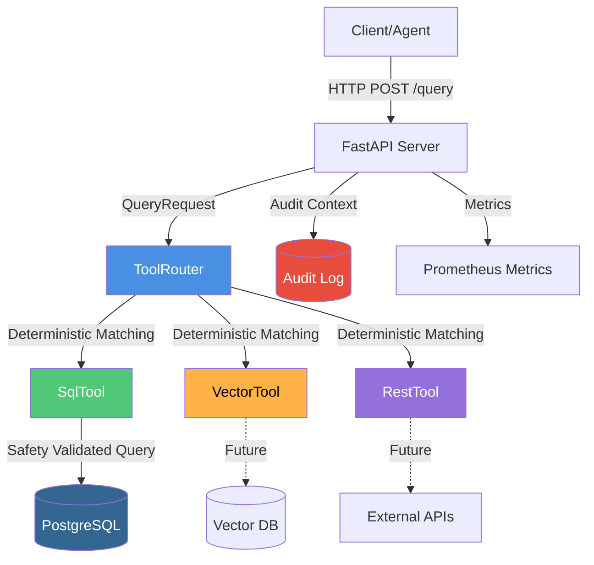
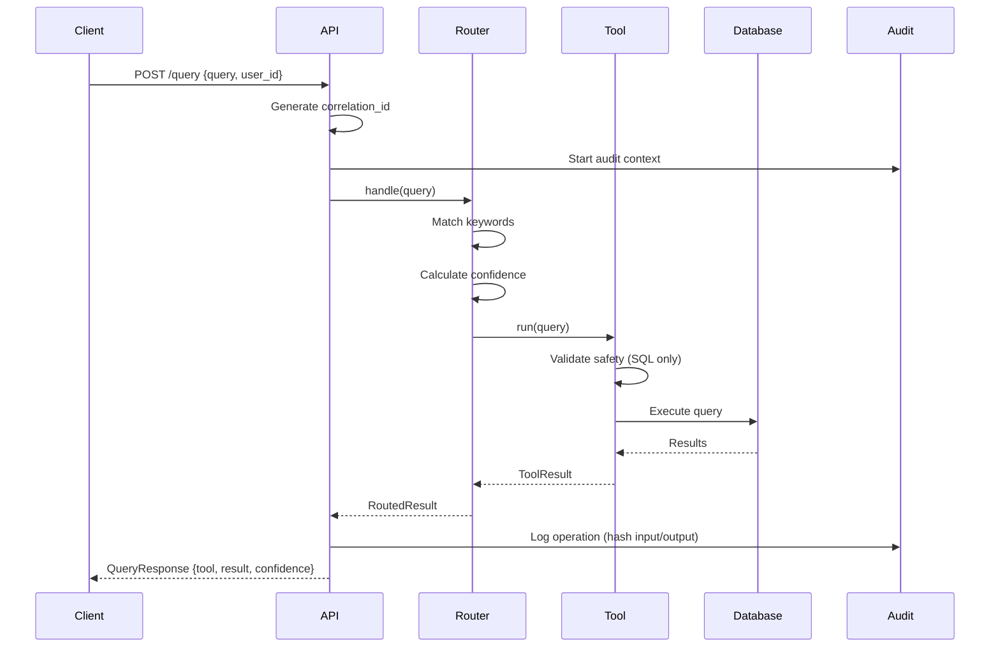

# Enterprise Tool Router - Architecture

## Overview

The Enterprise Tool Router is a deterministic routing system that intelligently directs natural language queries to specialized tools (SQL, Vector Search, REST API) based on keyword matching and confidence scoring.

## System Architecture

### High-Level Component Diagram

### Query Flow Sequence

## Component Details

### 1. ToolRouter (Deterministic)

**File**: `src/enterprise_tool_router/router.py`

The router uses deterministic keyword matching (no AI/LLM calls) to route queries.

**Routing Keywords**:
- **SQL**: SELECT, WHERE, GROUP BY, revenue, sales, query, database
- **Vector**: search, find, documentation, runbook, procedure, playbook
- **REST**: API, HTTP, endpoint, POST, GET, call

### 2. SqlTool (Safety-First)

**File**: `src/enterprise_tool_router/tools/sql.py`

**Safety Rules**:
1. **SELECT-only**: Only SELECT statements allowed
2. **No semicolons**: Prevents query chaining
3. **Blocked keywords**: INSERT, UPDATE, DELETE, DROP, CREATE, ALTER, TRUNCATE, GRANT, REVOKE, COPY
4. **Enforced LIMIT**: Adds LIMIT 200 if missing
5. **Table allowlist**: Only sales_fact, job_runs, audit_log accessible

### 3. Audit Logging (Append-Only)

**File**: `src/enterprise_tool_router/audit.py`

All query operations are logged to an append-only audit trail with SHA256 hashing.

**Audit Record Fields**:
- ts, correlation_id, user_id, tool, action
- input_hash, output_hash (SHA256)
- success, duration_ms

### 4. Pydantic Schemas (Type Safety)

All data structures use Pydantic V2 with:
- **Immutability**: frozen=True on all schemas
- **Type safety**: Strict validation at runtime
- **JSON serialization**: Automatic Decimal→float conversion

## Technology Stack

| Component | Technology | Version |
|-----------|-----------|---------|
| API Framework | FastAPI | Latest |
| Database | PostgreSQL | 17 |
| DB Driver | psycopg | 3.2.4 |
| Validation | Pydantic | 2.x |
| Testing | pytest | Latest |
| Metrics | Prometheus | Latest |
| CI/CD | GitHub Actions | N/A |

## Design Principles

1. **Safety First**: Multi-layer validation prevents destructive operations
2. **Deterministic Routing**: No AI/LLM calls for predictable behavior
3. **Immutable Audit Trail**: Append-only logging for compliance
4. **Type Safety**: Pydantic schemas catch errors at runtime
5. **Observable**: Prometheus metrics + structured logging
6. **Testable**: 38 tests with 100% safety coverage
7. **CI Quality Gates**: Automated enforcement of quality thresholds

## Performance Characteristics

- **Router Latency**: <1ms (deterministic keyword matching)
- **SQL Tool Latency**: 10-50ms (depends on query complexity)
- **Audit Logging Overhead**: <5ms (hashing + insert)
- **Default LIMIT**: 200 rows to prevent large result sets

## Future Enhancements

1. **Vector Tool**: Integrate ChromaDB/Pinecone for document search
2. **REST Tool**: Generic HTTP client with retry logic
3. **Caching**: Redis cache for frequent queries
4. **Rate Limiting**: Per-user rate limits
5. **Query Rewriting**: LLM-based query optimization

---

**Document Version**: 1.0  
**Last Updated**: 2026-02-16  
**Status**: Week 2 Complete (Commit 15)
