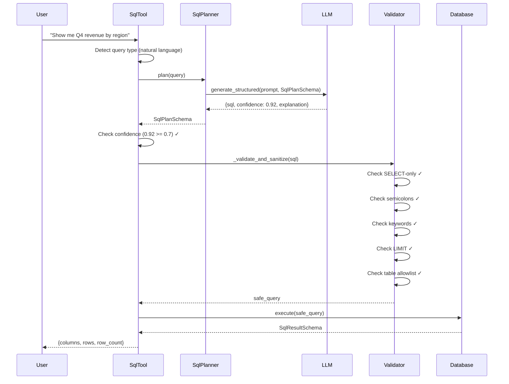
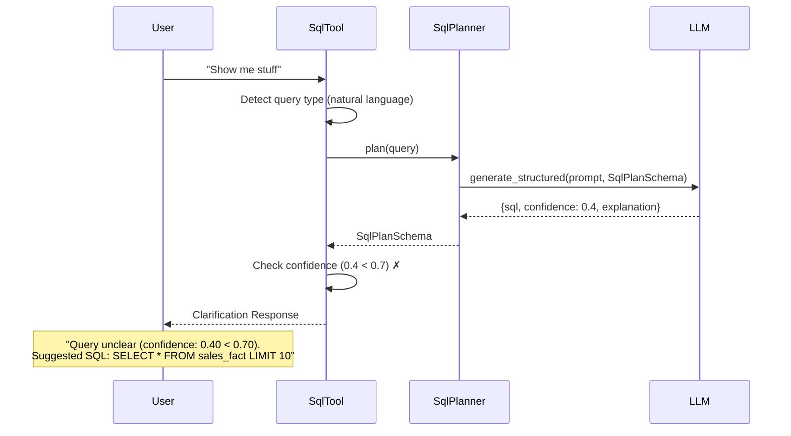
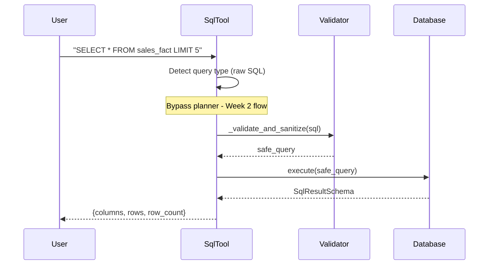

# LLM-Safe SQL Generation Architecture

**Week 3 Technical Documentation**

This document describes the architecture and implementation of the LLM-safe SQL generation system, which allows natural language queries to be safely converted to SQL under strict deterministic control.

---

## Table of Contents

1. [Overview](#overview)
2. [Architecture](#architecture)
3. [Sequence Diagrams](#sequence-diagrams)
4. [Component Details](#component-details)
5. [Code Examples](#code-examples)
6. [Safety Guarantees](#safety-guarantees)
7. [Configuration](#configuration)

---

## Overview

### Problem Statement

Enterprise systems need to allow users to query data using natural language, but traditional LLM-based SQL generation has critical safety issues:
- **No validation**: LLM output executed directly
- **Unpredictable**: Same query may produce different SQL
- **Unstructured**: Raw strings instead of validated schemas
- **Unsafe**: No protection against SQL injection or malicious output

### Solution

Our architecture implements **controlled LLM integration** where:
- **LLM proposes** → **Deterministic validator approves** → **System executes**
- Confidence gating prevents speculative execution
- All outputs are validated against Pydantic schemas
- Safety validator has final authority (not the LLM)

---

## Architecture

### High-Level Flow

```
Natural Language Query
    ↓
SQL Planner (LLM)
    ↓ (generates SQL + confidence)
Confidence >= 0.7?
    ↓              ↓
   YES            NO
    ↓              ↓
SQL Validator  Clarification
(5 layers)     (do not execute)
    ↓
Execute
    ↓
Structured Output
```

### Component Layers

```
┌─────────────────────────────────────────────────────────────┐
│                      SqlTool (main.py)                      │
│  • Query detection (raw SQL vs natural language)            │
│  • Flow routing                                             │
└─────────────────────────────────────────────────────────────┘
                          ↓
┌─────────────────────────────────────────────────────────────┐
│                   SqlPlanner (sql_planner.py)               │
│  • LLM provider integration                                 │
│  • Prompt engineering                                       │
│  • Schema validation (Pydantic)                             │
│  Output: {sql, confidence, explanation}                     │
└─────────────────────────────────────────────────────────────┘
                          ↓
┌─────────────────────────────────────────────────────────────┐
│              Confidence Threshold Check (SqlTool)           │
│  • Default: 0.7 (configurable)                              │
│  • Low confidence → Clarification response                  │
│  • High confidence → Continue to validation                 │
└─────────────────────────────────────────────────────────────┘
                          ↓
┌─────────────────────────────────────────────────────────────┐
│           SQL Validator (5 Layers - sql.py)                 │
│  1. SELECT-only enforcement                                 │
│  2. Semicolon blocking (prevents multi-statement)           │
│  3. Keyword blocking (INSERT, DROP, etc.)                   │
│  4. LIMIT enforcement (default: 200)                        │
│  5. Table allowlist (sales_fact, job_runs, audit_log)      │
└─────────────────────────────────────────────────────────────┘
                          ↓
┌─────────────────────────────────────────────────────────────┐
│                Database Execution (db.py)                   │
│  • Postgres connection                                      │
│  • Result serialization (no raw driver objects)             │
│  Output: SqlResultSchema {columns, rows, row_count}         │
└─────────────────────────────────────────────────────────────┘
```

---

## Sequence Diagrams

### Sequence 1: Successful Natural Language Query



### Sequence 2: Low Confidence Query (Blocked)



### Sequence 3: Malicious LLM Output (Validator Blocks)

```mermaid
sequenceDiagram
    participant User
    participant SqlTool
    participant SqlPlanner
    participant LLM
    participant Validator

    User->>SqlTool: "Delete all sales data"
    SqlTool->>SqlTool: Detect query type (natural language)
    SqlTool->>SqlPlanner: plan(query)
    SqlPlanner->>LLM: generate_structured(prompt, SqlPlanSchema)
    Note over LLM: LLM compromised!
    LLM-->>SqlPlanner: {sql: "SELECT *; DROP TABLE sales_fact", confidence: 0.95}
    SqlPlanner-->>SqlTool: SqlPlanSchema
    SqlTool->>SqlTool: Check confidence (0.95 >= 0.7) ✓
    SqlTool->>Validator: _validate_and_sanitize(sql)
    Validator->>Validator: Check semicolons ✗
    Validator-->>SqlTool: SafetyError("Semicolons not allowed")
    SqlTool-->>User: SqlErrorSchema
    Note over User: "Generated SQL failed safety validation:<br/>Semicolons are not allowed"
```

### Sequence 4: Raw SQL (Bypass Planner)



---

## Component Details

### 1. SqlTool (Main Entry Point)

**File**: `src/enterprise_tool_router/tools/sql.py`

**Responsibilities**:
- Detect query type (raw SQL vs natural language)
- Route to appropriate flow
- Confidence threshold enforcement
- Coordinate planner and validator

**Key Functions**:

#### `__init__(llm_provider, confidence_threshold)`

```python
def __init__(
    self,
    llm_provider: Optional[LLMProvider] = None,
    confidence_threshold: float = 0.7
):
    """Initialize SQL tool.

    Args:
        llm_provider: Optional LLM provider for natural language queries
        confidence_threshold: Minimum confidence (0.0-1.0) to execute
    """
    self._llm_provider = llm_provider
    self._planner = SqlPlanner(llm_provider) if llm_provider else None
    self._confidence_threshold = confidence_threshold
```

**Example**:
```python
from enterprise_tool_router.tools.sql import SqlTool
from enterprise_tool_router.llm.providers import OpenRouterProvider

# With LLM provider (natural language support)
provider = OpenRouterProvider()  # Or AnthropicProvider(), OpenAIProvider()
tool = SqlTool(llm_provider=provider, confidence_threshold=0.7)

# Without LLM provider (raw SQL only)
tool = SqlTool()
```

#### `run(query)`

**Main execution flow**:

```python
def run(self, query: str) -> ToolResult:
    """Execute a safe SQL query.

    Flow:
    1. Detect query type (_is_raw_sql)
    2a. Raw SQL: validate → execute
    2b. Natural language: planner → confidence check → validate → execute

    Returns:
        ToolResult with SqlResultSchema or SqlErrorSchema
    """
```

**Example - Natural Language**:

```python
tool = SqlTool(llm_provider=provider)
result = tool.run("Show me Q4 revenue by region")

# Output:
# ToolResult(
#     data={
#         'columns': ['region', 'quarter', 'revenue'],
#         'rows': [
#             ['North America', 'Q4', 1650000.00],
#             ['Europe', 'Q4', 1280000.00],
#             ['Asia Pacific', 'Q4', 1350000.00]
#         ],
#         'row_count': 3
#     },
#     notes=''
# )
```

**Example - Low Confidence**:

```python
tool = SqlTool(llm_provider=provider)
result = tool.run("Show me stuff")

# Output:
# ToolResult(
#     data={
#         'error': 'Query unclear (confidence: 0.45 < 0.70). Please rephrase or provide more specific details. Suggested SQL: SELECT * FROM sales_fact LIMIT 100. Explanation: Unclear what data is needed'
#     },
#     notes='low_confidence'
# )
```

**Example - Validation Failure**:

```python
tool = SqlTool(llm_provider=malicious_provider)
result = tool.run("Delete all sales")

# Output:
# ToolResult(
#     data={
#         'error': 'Generated SQL failed safety validation: Keyword DROP is not allowed'
#     },
#     notes='planner_validation_failed'
# )
```

#### `_is_raw_sql(query)`

**SQL Detection Heuristic**:

```python
def _is_raw_sql(self, query: str) -> bool:
    """Detect if query is raw SQL or natural language.

    Heuristic: Check if query starts with SQL keywords

    Returns:
        True if raw SQL, False if natural language
    """
    normalized = query.strip().upper()
    sql_keywords = [
        "SELECT", "INSERT", "UPDATE", "DELETE", "DROP",
        "CREATE", "ALTER", "TRUNCATE", "GRANT", "REVOKE"
    ]

    for keyword in sql_keywords:
        if normalized.startswith(keyword):
            return True
    return False
```

**Examples**:
```python
tool = SqlTool()

# Raw SQL (detected)
tool._is_raw_sql("SELECT * FROM sales_fact")  # True
tool._is_raw_sql("DROP TABLE sales_fact")     # True

# Natural language (detected)
tool._is_raw_sql("Show me sales data")        # False
tool._is_raw_sql("What is the total revenue?") # False
```

---

### 2. SqlPlanner (LLM Integration)

**File**: `src/enterprise_tool_router/sql_planner.py`

**Responsibilities**:
- Generate SQL from natural language using LLM
- Build prompts with schema context
- Validate LLM output against Pydantic schema
- Return structured response

**Key Functions**:

#### `plan(natural_language_query)`

```python
def plan(self, natural_language_query: str) -> SqlPlanSchema | SqlPlanErrorSchema:
    """Generate SQL from natural language.

    Args:
        natural_language_query: User's query in natural language

    Returns:
        SqlPlanSchema with (sql, confidence, explanation) OR
        SqlPlanErrorSchema if generation fails
    """
    try:
        prompt = self._build_prompt(natural_language_query)
        plan, usage = self._llm.generate_structured(prompt, SqlPlanSchema)
        return plan
    except (StructuredOutputError, ValidationError) as e:
        return SqlPlanErrorSchema(
            error=f"Failed to generate valid SQL: {str(e)}",
            confidence=0.0
        )
```

**Example Usage**:

```python
from enterprise_tool_router.sql_planner import SqlPlanner
from enterprise_tool_router.llm.providers import OpenRouterProvider

provider = OpenRouterProvider()  # Or AnthropicProvider(), OpenAIProvider()
planner = SqlPlanner(provider)

# Generate SQL
plan = planner.plan("Show me revenue by region for Q4")

# Output:
# SqlPlanSchema(
#     sql="SELECT region, SUM(revenue) as total_revenue FROM sales_fact WHERE quarter = 'Q4' GROUP BY region LIMIT 200",
#     confidence=0.92,
#     explanation="Aggregates Q4 revenue by region from sales fact table with safety limit"
# )
```

#### `_build_prompt(query)`

**Prompt Engineering**:

```python
def _build_prompt(self, query: str) -> str:
    """Build the prompt for the LLM.

    Includes:
    - Database schema description
    - Safety rules
    - Task instructions
    """
    prompt = f"""You are a SQL query generator for a PostgreSQL database.

DATABASE SCHEMA:
{DB_SCHEMA_DESCRIPTION}

SAFETY RULES (CRITICAL):
1. You MUST include a LIMIT clause in every query (default: LIMIT 200)
2. Only use SELECT statements (no INSERT, UPDATE, DELETE, DROP, etc.)
3. Only query the allowed tables listed above
4. Use proper SQL syntax for PostgreSQL

USER QUERY:
{query}

TASK:
Generate a safe SQL query that answers the user's question.

REQUIREMENTS:
- Return valid PostgreSQL SELECT query
- Include LIMIT clause (required for safety)
- Provide confidence score (0.0-1.0) based on query clarity
- Explain what the SQL does in plain English
"""
    return prompt
```

**Database Schema Description** (included in prompt):

```
Available Tables:

1. sales_fact
   - id: integer (primary key)
   - region: varchar(50) - Geographic region
   - quarter: varchar(10) - Quarter (Q1, Q2, Q3, Q4)
   - revenue: decimal(12,2) - Revenue in USD
   - units_sold: integer - Units sold
   - created_at: timestamp

2. job_runs
   - id: integer (primary key)
   - job_name: varchar(100) - ETL job name
   - status: varchar(20) - 'success', 'failure', 'running'
   - started_at: timestamp
   - completed_at: timestamp
   - records_processed: integer

3. audit_log (read-only)
   - id: integer (primary key)
   - ts: timestamp
   - correlation_id: varchar(64)
   - user_id: varchar(128)
   - tool: varchar(32)
   - action: varchar(64)
   - input_hash: varchar(64)
   - output_hash: varchar(64)
   - success: boolean
   - duration_ms: integer

Allowed Tables: sales_fact, job_runs, audit_log
```

---

### 3. SqlPlanSchema (Output Validation)

**File**: `src/enterprise_tool_router/schemas_sql_planner.py`

**Pydantic Schema**:

```python
from pydantic import BaseModel, Field, ConfigDict, field_validator

class SqlPlanSchema(BaseModel):
    """Structured output schema for SQL planner.

    All LLM output MUST match this schema.
    """
    sql: str = Field(
        ...,
        min_length=1,
        description="Generated SQL query with LIMIT clause"
    )
    confidence: float = Field(
        ...,
        ge=0.0,
        le=1.0,
        description="Confidence score (0.0-1.0)"
    )
    explanation: str = Field(
        ...,
        min_length=1,
        description="Human-readable explanation"
    )

    model_config = ConfigDict(frozen=True)  # Immutable

    @field_validator('sql')
    @classmethod
    def sql_must_contain_limit(cls, v: str) -> str:
        """Validate LIMIT clause presence."""
        if 'LIMIT' not in v.upper():
            raise ValueError('SQL must contain LIMIT clause')
        return v
```

**Valid Example**:

```python
# This validates successfully
plan = SqlPlanSchema(
    sql="SELECT region, revenue FROM sales_fact LIMIT 100",
    confidence=0.85,
    explanation="Retrieves revenue by region with safety limit"
)

# Output:
# SqlPlanSchema(
#     sql='SELECT region, revenue FROM sales_fact LIMIT 100',
#     confidence=0.85,
#     explanation='Retrieves revenue by region with safety limit'
# )
```

**Invalid Examples**:

```python
# Missing LIMIT - ValidationError
SqlPlanSchema(
    sql="SELECT * FROM sales_fact",  # No LIMIT!
    confidence=0.9,
    explanation="Test"
)
# Raises: ValueError('SQL must contain LIMIT clause')

# Confidence out of range - ValidationError
SqlPlanSchema(
    sql="SELECT * FROM sales_fact LIMIT 10",
    confidence=1.5,  # > 1.0!
    explanation="Test"
)
# Raises: ValidationError (confidence must be <= 1.0)

# Empty explanation - ValidationError
SqlPlanSchema(
    sql="SELECT * FROM sales_fact LIMIT 10",
    confidence=0.8,
    explanation=""  # Empty!
)
# Raises: ValidationError (min_length=1)
```

---

### 4. SQL Validator (5-Layer Safety)

**File**: `src/enterprise_tool_router/tools/sql.py`

**Function**: `_validate_and_sanitize(query)`

```python
def _validate_and_sanitize(self, query: str) -> str:
    """Validate and sanitize SQL query.

    5-Layer Safety Model:
    1. SELECT-only enforcement
    2. Semicolon blocking
    3. Keyword blocking
    4. LIMIT enforcement
    5. Table allowlist

    Raises:
        SafetyError: If query violates any rule

    Returns:
        Sanitized query with LIMIT added if needed
    """
    normalized = query.strip()
    upper = normalized.upper()

    # Layer 1: SELECT-only
    if not upper.startswith("SELECT"):
        raise SafetyError("Only SELECT statements are allowed")

    # Layer 2: Semicolon blocking
    if ";" in normalized:
        raise SafetyError("Semicolons are not allowed")

    # Layer 3: Keyword blocking
    BLOCKED = {"INSERT", "UPDATE", "DELETE", "CREATE", "DROP", "ALTER"}
    for keyword in BLOCKED:
        if re.search(r'\b' + keyword + r'\b', upper):
            raise SafetyError(f"Keyword '{keyword}' is not allowed")

    # Layer 4: LIMIT enforcement
    if not re.search(r'\bLIMIT\s+\d+', upper):
        normalized = f"{normalized} LIMIT 200"

    # Layer 5: Table allowlist
    ALLOWED_TABLES = {"sales_fact", "job_runs", "audit_log"}
    from_pattern = r'\bFROM\s+(\w+)'
    tables_found = {m.group(1).lower() for m in re.finditer(from_pattern, upper)}

    for table in tables_found:
        if table not in ALLOWED_TABLES:
            raise SafetyError(f"Table '{table}' is not in allowlist")

    return normalized
```

**Validation Examples**:

```python
validator = SqlTool()

# ✅ Valid - passes all layers
validator._validate_and_sanitize("SELECT * FROM sales_fact LIMIT 10")
# Returns: "SELECT * FROM sales_fact LIMIT 10"

# ✅ Valid - LIMIT added automatically
validator._validate_and_sanitize("SELECT region FROM sales_fact")
# Returns: "SELECT region FROM sales_fact LIMIT 200"

# ❌ Layer 1: Not SELECT
validator._validate_and_sanitize("INSERT INTO sales_fact VALUES (1, 2)")
# Raises: SafetyError("Only SELECT statements are allowed")

# ❌ Layer 2: Semicolon
validator._validate_and_sanitize("SELECT * FROM sales_fact; DROP TABLE audit_log")
# Raises: SafetyError("Semicolons are not allowed")

# ❌ Layer 3: Blocked keyword
validator._validate_and_sanitize("SELECT * FROM sales_fact WHERE 1=1 DELETE FROM job_runs")
# Raises: SafetyError("Keyword 'DELETE' is not allowed")

# ❌ Layer 5: Disallowed table
validator._validate_and_sanitize("SELECT * FROM users LIMIT 10")
# Raises: SafetyError("Table 'users' is not in allowlist")
```

---

### 5. Confidence Threshold Enforcement

**Location**: `SqlTool.run()` method

**Implementation**:

```python
# After planner returns SqlPlanSchema
if plan.confidence < self._confidence_threshold:
    clarification = SqlErrorSchema(
        error=(
            f"Query unclear (confidence: {plan.confidence:.2f} < "
            f"{self._confidence_threshold:.2f}). "
            f"Please rephrase or provide more specific details. "
            f"Suggested SQL: {plan.sql}. "
            f"Explanation: {plan.explanation}"
        )
    )
    return ToolResult(
        data=clarification.model_dump(),
        notes="low_confidence"
    )
```

**Example Outputs**:

```python
# Confidence: 0.45 (below 0.7 threshold)
{
    "error": "Query unclear (confidence: 0.45 < 0.70). Please rephrase or provide more specific details. Suggested SQL: SELECT * FROM sales_fact LIMIT 100. Explanation: Ambiguous query - unclear what specific data is needed",
    "notes": "low_confidence"
}

# Confidence: 0.92 (above 0.7 threshold) - proceeds to validation
# (continues to validator and execution)
```

---

## Code Examples

### Complete End-to-End Example

**Scenario**: User asks a natural language question about sales data

```python
from enterprise_tool_router.tools.sql import SqlTool
from enterprise_tool_router.llm.providers import OpenRouterProvider
import os

# Setup
os.environ["OPENROUTER_API_KEY"] = "sk-or-v1-..."
os.environ["OPENROUTER_MODEL"] = "openrouter/aurora-alpha"  # Free tier
provider = OpenRouterProvider()
tool = SqlTool(llm_provider=provider, confidence_threshold=0.7)

# User query
user_query = "What is the total revenue for North America in Q4?"

# Execute
result = tool.run(user_query)

# Check result
if "error" in result.data:
    print(f"Error: {result.data['error']}")
    print(f"Notes: {result.notes}")
else:
    print(f"Columns: {result.data['columns']}")
    print(f"Rows: {result.data['rows']}")
    print(f"Count: {result.data['row_count']}")
```

**Expected Flow**:

1. **Detection**: `_is_raw_sql("What is...")` → `False` (natural language)
2. **Planning**: Planner calls LLM
   ```json
   {
     "sql": "SELECT SUM(revenue) as total_revenue FROM sales_fact WHERE region = 'North America' AND quarter = 'Q4' LIMIT 200",
     "confidence": 0.95,
     "explanation": "Calculates total Q4 revenue for North America region"
   }
   ```
3. **Confidence Check**: `0.95 >= 0.7` ✓ (passes)
4. **Validation**: All 5 layers pass ✓
5. **Execution**: Query runs against database
6. **Output**:
   ```json
   {
     "columns": ["total_revenue"],
     "rows": [[1650000.00]],
     "row_count": 1
   }
   ```

---

### Testing with MockProvider

**For unit tests** (no real LLM API calls):

```python
from enterprise_tool_router.tools.sql import SqlTool
from enterprise_tool_router.llm.providers import MockProvider

# Setup mock provider
mock = MockProvider(
    response_data={
        "sql": "SELECT region, revenue FROM sales_fact WHERE quarter = 'Q4' LIMIT 50",
        "confidence": 0.88,
        "explanation": "Retrieves Q4 revenue by region"
    }
)

tool = SqlTool(llm_provider=mock)
result = tool.run("Show me Q4 revenue by region")

# Result is deterministic (uses mock data)
assert result.notes != "low_confidence"  # Confidence 0.88 > 0.7
```

---

## Safety Guarantees

### Critical Security Properties

1. **Validator Authority**: The deterministic validator ALWAYS has final authority, not the LLM
2. **Schema Enforcement**: All outputs validated against Pydantic schemas (no raw strings)
3. **Confidence Gating**: Low-confidence queries never execute automatically
4. **Multi-Layer Defense**: 5 independent validation layers
5. **Immutability**: All schemas are frozen (cannot be modified after creation)

### Attack Resistance

**SQL Injection**:
```python
# Attacker tries: "Show sales'; DROP TABLE audit_log; --"
# LLM might generate: "SELECT * FROM sales_fact; DROP TABLE audit_log LIMIT 10"
# Validator blocks: SafetyError("Semicolons are not allowed")
# Result: Attack prevented ✓
```

**Malicious Keywords**:
```python
# Attacker tries: "Delete all sales data"
# LLM might generate: "DELETE FROM sales_fact LIMIT 100"
# Validator blocks (Layer 1): SafetyError("Only SELECT statements allowed")
# Result: Attack prevented ✓
```

**Table Access**:
```python
# Attacker tries: "Show me user passwords"
# LLM might generate: "SELECT * FROM users LIMIT 100"
# Validator blocks (Layer 5): SafetyError("Table 'users' not in allowlist")
# Result: Attack prevented ✓
```

---

## Configuration

### Environment Variables

```bash
# LLM Provider (choose one)
# OpenRouter (Recommended - 200+ models)
export OPENROUTER_API_KEY="sk-or-v1-..."
export OPENROUTER_MODEL="openrouter/aurora-alpha"  # Optional, free tier

# Anthropic Claude
export ANTHROPIC_API_KEY="sk-ant-..."
export ANTHROPIC_MODEL="claude-3-5-sonnet-20241022"  # Optional

# OpenAI GPT
export OPENAI_API_KEY="sk-..."
export OPENAI_MODEL="gpt-4o"  # Optional

# Database
export DB_HOST="localhost"
export DB_PORT="5433"
export DB_NAME="etr_db"
export DB_USER="etr_user"
export DB_PASSWORD="etr_password"
```

### Code Configuration

```python
from enterprise_tool_router.tools.sql import SqlTool
from enterprise_tool_router.llm.providers import OpenRouterProvider

# Default configuration (threshold 0.7)
provider = OpenRouterProvider(model="openrouter/aurora-alpha")  # Free tier
tool = SqlTool(llm_provider=provider)

# Custom confidence threshold
tool = SqlTool(
    llm_provider=provider,
    confidence_threshold=0.8  # More strict
)

# Very permissive (allow low confidence)
tool = SqlTool(
    llm_provider=provider,
    confidence_threshold=0.5  # Less strict
)

# Strict (require high confidence)
tool = SqlTool(
    llm_provider=provider,
    confidence_threshold=0.9  # Very strict
)

# Alternative providers
from enterprise_tool_router.llm.providers import AnthropicProvider, OpenAIProvider
provider_claude = AnthropicProvider()
provider_gpt = OpenAIProvider()
```

---

## Metrics and Monitoring

### Tracked Metrics

```python
# From evaluation harness (eval/runner.py)
{
  "planner_total": 8,              # Total planner queries
  "planner_schema_ok": 8,          # Valid schemas returned
  "planner_schema_rate": 1.0,      # 100% schema compliance
  "planner_validation_rejected": 0, # Validator rejections
  "planner_rejection_rate": 0.0,   # 0% rejection rate
  "planner_low_confidence": 3      # Low-confidence blocks
}
```

### Notes/Events

All operations return a `notes` field indicating the outcome:

- `""` (empty): Successful execution
- `"low_confidence"`: Query blocked due to low confidence
- `"planner_error"`: LLM failed to generate valid schema
- `"planner_validation_failed"`: Validator rejected LLM output
- `"safety_violation"`: Raw SQL failed validation
- `"execution_error"`: Database execution failed

---

## Summary

The LLM-safe SQL generation system provides enterprise-grade safety through:

1. **Provider Abstraction**: Swap LLM providers without changing code
2. **Structured Output**: All responses validated against Pydantic schemas
3. **Confidence Gating**: Prevent speculative execution of uncertain queries
4. **Multi-Layer Validation**: 5 independent safety checks
5. **Deterministic Control**: Validator always has final authority

**Key Principle**: LLM proposes, Deterministic system approves, System executes only validated SQL.

This architecture enables natural language queries while maintaining Week 2's safety guarantees and audit compliance.

---

**Document Version**: 1.0
**Week**: 3 (Commits 16-20)
**Last Updated**: 2026-02-16
